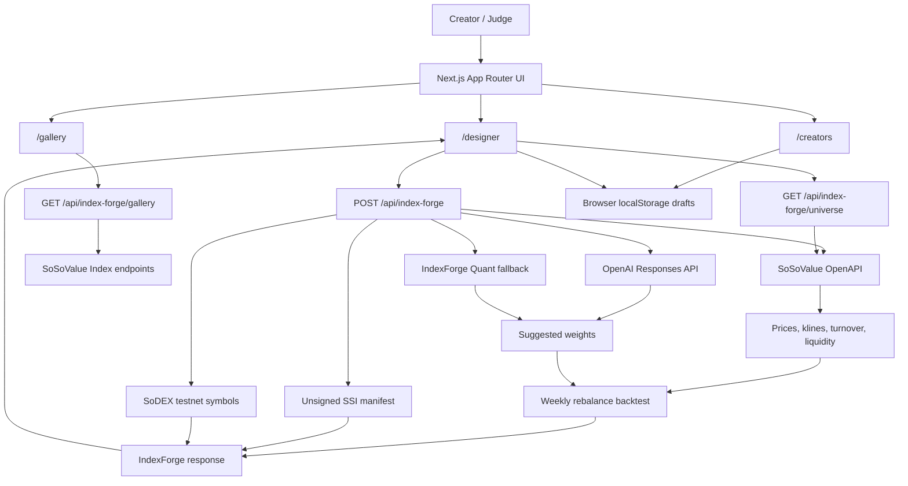

# IndexForge

<p align="center">
  
</p>

<p align="center">
  <strong>Forge live crypto market themes into validated draft indexes.</strong>
</p>

Design, validate, and prepare draft on-chain thematic indexes, powered by SSI Protocol, SoSoValue, SoSoValue Indexes, AI, and SoDEX.

IndexForge turns a market theme like `AI infrastructure`, `DeFi blue chips`, or `SoDEX tradable majors` into a live crypto index. A creator chooses 3-8 tokens, the app pulls real SoSoValue market data, the composer suggests weights, the UI backtests the basket against BTC, and the SSI/SoDEX path shows how the index can become a wrapped on-chain product that others follow.

Live production app: https://indexfordge.vercel.app

## Project Overview

IndexForge is a creator tool for turning a crypto market idea into a draft investable index. Instead of manually collecting prices, choosing weights in a spreadsheet, and guessing whether a basket is executable, IndexForge connects live market data, transparent weighting, backtesting, SSI-style index metadata, and SoDEX execution checks into one workflow.

The app is built for index creators, crypto researchers, and hackathon judges who want to see the full path from idea to validated product:

1. Start with a theme such as `AI infrastructure`, `DeFi blue chips`, or `SoDEX tradable majors`.
2. Select 3-8 tokens from the live SoSoValue universe.
3. Generate weights with OpenAI or the built-in market-signal composer.
4. Adjust those weights manually with sliders.
5. Backtest the basket against BTC using recent SoSoValue daily closes.
6. Inspect risk, liquidity, concentration, and holdout validation.
7. Produce an unsigned SSI-style index manifest.
8. Check whether the intended rebalance legs map to live SoDEX testnet markets.
9. Save a browser-local draft and view it in the gallery and creator profile pages.

The important idea is that IndexForge does not pretend a draft index is already live on-chain. It shows the honest pre-production path: live data first, transparent methodology second, validation third, and signed on-chain or exchange execution only after the required credentials and checks exist.

## Visual Flow

```mermaid
flowchart LR
  A["Creator theme"] --> B["Live token picker"]
  B --> C["SoSoValue data"]
  C --> D["OpenAI or quant composer"]
  D --> E["Manual slider edits"]
  E --> F["Backtest vs BTC"]
  F --> G["Validation report"]
  G --> H["SSI draft manifest"]
  H --> I["SoDEX execution intent"]
  I --> J["Browser-saved draft"]

  B -. "Full universe search" .-> C
  D -. "Weights sum to 100%" .-> E
  I -. "No fake trades" .-> J
```



## System Diagram



## Why It Is Useful

Creating a crypto index normally requires several disconnected pieces: market-data APIs, quant weighting logic, backtesting, index methodology docs, trading venue checks, and a publishing layer. IndexForge compresses that into one interface so a solo creator can prototype an index business quickly.

Useful outcomes:

- Creators can test market themes without hardcoding performance numbers.
- Users can compare a basket against BTC before trusting the idea.
- Judges can inspect where every metric comes from.
- The app can show whether selected assets are tradable on SoDEX testnet before pretending execution is ready.
- Draft manifests make the methodology portable for future SSI Protocol submission.
- Browser-local gallery and creator profiles demonstrate the product loop without inventing fake public users or fake transactions.

## What The Demo Proves

- Live SoSoValue data can power token discovery, price history, market snapshots, liquidity checks, and SSI reference context.
- AI-generated weights can be constrained to real selected tokens and normalized to 100%.
- A deterministic quant fallback keeps the app useful even if the OpenAI call fails.
- Manual edits are not cosmetic; they rerun through the same API, backtest, validation, SSI manifest, and SoDEX intent pipeline.
- SoDEX execution is handled as an intent and readiness check, not as a fake trade.
- The app is deployed on Vercel with encrypted environment variables and production API routes.

## Wave 2 Status

Wave 2 delivery window: 

Production app: https://indexfordge.vercel.app

What is working now:

- Real SoSoValue API integration using `x-soso-api-key`.
- Live token resolution from `GET /currencies`.
- Full token-universe search from live SoSoValue data, including common symbols such as `BTC`, `ETH`, `SOL`, `DOGE`, `AAVE`, and `LINK`.
- Live market snapshots from `GET /currencies/{currency_id}/market-snapshot`.
- Up to 90 days of daily price history from `GET /currencies/{currency_id}/klines`.
- Optional token sector and project context from `GET /currencies/{currency_id}` when `SOSOVALUE_ENABLE_PROJECT_INFO=true`.
- AI Composer route with OpenAI support through `OPENAI_API_KEY`.
- SoSoValue-only quant composer fallback when no OpenAI key is present or an AI call fails.
- Full designer page at `/designer` with theme input, token picker, quick presets, and manual weight sliders.
- `SoDEX majors` preset for a cleaner execution demo using testnet-listed assets.
- Manual slider edits posted back to the API, normalized to 100%, and rerun through the same backtest and validation path.
- Weight display as live bars with rationale and transparent signal scores.
- Weekly-rebalanced backtest versus BTC with return, drawdown, volatility, Sharpe-style ratio, win rate, rebalance count, and assumptions.
- Holdout validation with training days, holdout days, effective names, max-weight concentration, and liquidity checks.
- SSI manifest generation with methodology, ticker, data window, and constituent weights.
- Rate-limit-safe SoSoValue Indexes comparison for live SSI reference context.
- SoDEX testnet market simulation using live `GET /markets/symbols` metadata.
- Gallery page at `/gallery` combining live SoSoValue Indexes with browser-saved IndexForge draft manifests.
- Creator profiles at `/creators`, grouped from browser-saved local drafts without fake creators or fake performance.
- Rate-limit-aware request caching, in-flight SoSoValue fetch dedupe, composer rate limiting, and safer API validation.
- Optional snapshot and SSI-reference enrichments fail fast under upstream `429` responses so core index generation still returns.
- Vercel production deployment with encrypted environment variables for SoSoValue, OpenAI, and SSI-related config.

No price, volume, market cap, flow, return, weight, or backtest number is hardcoded. The default token symbols and quick presets are only starting selections; the designer can load the broader SoSoValue universe at runtime.

Current Wave 2 boundary: browser-saved drafts are local demo records, not shared backend records yet. Signed SSI submission and signed SoDEX batch order submission remain intentionally gated behind future credentialed server routes.

## What It Does

IndexForge lets anyone forge a crypto theme into an investable index:

1. Enter a theme and choose tokens.
2. Fetch live SoSoValue price, turnover, sector, and kline data.
3. Generate suggested weights with OpenAI when configured, or with the built-in SoSoValue signal composer.
4. Adjust weights with manual sliders and rerun the same backtest/validation path.
5. Display each token weight, rationale, 30-day activity, and live market metrics.
6. Backtest the weighted index against BTC using daily SoSoValue closes and weekly rebalance logic.
7. Save a browser-local draft manifest into the gallery and creator profile workflow.
8. Simulate the SoDEX testnet order legs against live SoDEX spot symbol metadata.
9. Use the `SoDEX majors` preset to demo a basket that maps to live SoDEX testnet markets.

Example default theme: `AI infrastructure`

Default tokens:

- `TAO`
- `RENDER`
- `FET`
- `AKT`
- `NMR`

## How It Works

Data layer:

SoSoValue is the source of truth. The app resolves token symbols to currency IDs, loads current market snapshots, loads up to 90 daily klines, and exposes the live token universe for the designer. The default route keeps project-info enrichment off to stay under SoSoValue rate limits; set `SOSOVALUE_ENABLE_PROJECT_INFO=true` to also read sectors and project introductions from `GET /currencies/{currency_id}`. The 30-day flow value is computed from real kline volume multiplied by close price, while 24-hour turnover comes directly from the market snapshot.

AI layer:

The route is OpenAI-ready. If `OPENAI_API_KEY` is set, the app sends compact SoSoValue metrics to the OpenAI Responses API and asks for structured JSON weights that sum to 100. If no OpenAI key is available, the app uses a transparent scoring model based on theme fit, 30-day momentum, flow trend, 30-day traded value, liquidity, rank, and volatility. Wave 2 also supports manual slider weights, normalized by the backend and evaluated through the same validation pipeline.

Chain layer:

The app keeps the publish state honest: it creates an index name, ticker, weekly rebalance methodology, unsigned SSI manifest, SoSoValue Indexes overlap references, and a SoDEX testnet rebalance simulation without generating fake addresses or fake transactions. Browser-saved drafts are local demo artifacts, not shared backend records yet. SoDEX signed submission remains gated on account credentials, API key name, and an EIP-712 signing key.

Performance and safety layer:

- The composer keeps a short server-side response cache for repeated requests.
- SoSoValue fetches are deduped while in flight so parallel UI calls do not stampede the API key.
- Composer requests are rate-limited per forwarded client address.
- Expensive project-info enrichment is opt-in via `SOSOVALUE_ENABLE_PROJECT_INFO=true`.
- Optional snapshot and SSI-reference enrichments fail fast under upstream 429s so core index generation still returns.
- Bad token and weight payloads return explicit `400` responses instead of internal errors.
- SoSoValue 429s return a clear retry message.

## Local Setup

```bash
corepack pnpm install
corepack pnpm dev
```

Then open:

```text
http://localhost:3000
```

Environment variables:

```bash
SOSOVALUE_API_KEY=your_sosovalue_key
SOSOVALUE_BASE_URL=https://openapi.sosovalue.com/openapi/v1
SOSOVALUE_ENABLE_PROJECT_INFO=false
OPENAI_API_KEY=optional_openai_key
OPENAI_MODEL=gpt-4.1-mini
SSI_PROTOCOL_KEY=optional_wave_3_key
SODEX_SPOT_ENDPOINT=https://testnet-gw.sodex.dev/api/v1/spot
SODEX_ACCOUNT_ID=optional_sodex_account
SODEX_API_KEY_NAME=optional_sodex_key_name
SODEX_API_PRIVATE_KEY=optional_server_side_signing_key
```

The local `.env.local` is ignored by git. Do not commit real keys.

Production preview:

```bash
corepack pnpm build
corepack pnpm start
```

## API Route

Composer endpoint:

```http
POST /api/index-forge
```

Body:

```json
{
  "theme": "AI infrastructure",
  "tokens": ["TAO", "RENDER", "FET", "AKT", "NMR"]
}
```

Returns:

- resolved SoSoValue token data from the full live token universe
- AI or signal-composer weights
- manual slider weights when supplied
- weekly-rebalanced backtest points versus BTC
- risk metrics, assumptions, holdout validation, and overfit notes
- SSI manifest, rate-limit-safe SoSoValue Indexes references, and SoDEX testnet simulation state
- warnings for missing symbols, missing OpenAI credentials, or upstream rate limits

## Wave Roadmap

### Wave 1: Prove the Concept

 

- Project overview and README.
- SoSoValue price, turnover, sector, and kline data for at least 5 tokens.
- OpenAI-compatible AI Composer endpoint.
- Static/live index display with weight bars.
- 30-day BTC comparison backtest.
- Demo-ready Next.js UI using the supplied hero animation and styling.

### Wave 2: Working Product

 

Wave 2 is now implemented as a working product flow, not just a static demo:

- Full index designer shipped at `/designer` with theme input, live SoSoValue token universe search, token picker, and manual weight sliders.
- Quick presets shipped for the default AI infrastructure basket, a SoDEX-tradable majors basket, and a DeFi core basket.
- Manual slider edits are posted back to the Next API route, normalized to 100%, and rerun through the same SoSoValue backtest, validation, SSI, and SoDEX pipeline.
- Backtesting now uses the latest shared kline window, weekly target rebalance logic, BTC comparison, drawdown, volatility, Sharpe-style ratio, win rate, rebalance count, and explicit assumptions.
- Validation now shows a training/holdout split, holdout return versus BTC, effective names, max-weight concentration, liquidity checks, and overfit notes.
- Gallery shipped at `/gallery`, combining real SoSoValue Indexes data with browser-saved IndexForge draft manifests.
- Creator profiles shipped at `/creators`, grouped from the user's local draft manifests without fake creators or fake performance.
- SoDEX testnet simulation resolves intended rebalance legs against live `GET /markets/symbols` metadata and marks each leg as executable or not listed before any signed submission.
- `SoDEX majors` preset added for a cleaner execution demo against testnet-listed assets.
- Next API backend routes now support composer, live token universe, and gallery data.
- Production deployment shipped on Vercel at https://indexfordge.vercel.app.

Wave 2 product surfaces:

- `/` introduces the product and links into the working designer, gallery, and creator views.
- `/designer` is the main workflow: choose a theme, pick tokens, compose weights, adjust sliders, inspect backtest metrics, inspect SSI references, and stage SoDEX testnet execution intent.
- `/gallery` shows live SoSoValue Indexes plus browser-saved IndexForge draft manifests.
- `/creators` groups browser-saved drafts by creator name and summarizes best return and average drawdown.
- `/api/index-forge` composes a full index response from live SoSoValue data, OpenAI or the local quant fallback, backtest validation, SSI manifest data, and SoDEX intent data.
- `/api/index-forge/universe` exposes the full SoSoValue token universe for search.
- `/api/index-forge/gallery` loads live SoSoValue Indexes for the gallery.

Wave 2 reliability and security work:

- Added full token-universe search so common symbols such as `BTC`, `ETH`, `SOL`, `DOGE`, `AAVE`, and `LINK` are discoverable.
- Added explicit token and weight validation so malformed API payloads return `400` instead of internal errors.
- Added per-client composer rate limiting to protect API-backed routes.
- Added short server-side composer caching for repeated requests.
- Added in-flight SoSoValue fetch deduplication to avoid duplicate upstream calls during concurrent UI requests.
- Deferred token-universe loading until after the initial composer load to avoid cold-start API bursts.
- Made expensive project-info enrichment opt-in with `SOSOVALUE_ENABLE_PROJECT_INFO=true`.
- Made optional snapshot and SSI-reference enrichments fail fast under upstream `429` responses so core index generation still returns.
- Hardened OpenAI response handling and fallback behavior so non-JSON upstream responses do not leak raw provider text into the UI.
- Added a reduced-motion CSS fallback that hides the WebGL canvas for users who prefer reduced motion.
- Removed stale tracked Next.js runtime logs from the repository.

Wave 2 deployment and verification:

- Vercel production deployment: https://indexfordge.vercel.app
- Latest production deployment status: Ready.
- Local checks run before deploy: `corepack pnpm lint` and `corepack pnpm build`.
- Vercel build completed successfully with Next.js 16.2.6.
- Production smoke checks confirmed `/api/index-forge/universe` returns the live universe with `BTC` and `ETH`.
- Production smoke checks confirmed `/api/index-forge` returns a 5-token default AI infrastructure index.
- Browser smoke checks confirmed `/designer` loads, `SoDEX majors` stages `BTC, ETH, SOL, AAVE, LINK`, token search returns `BTC`, and no browser console errors were observed.

Wave 2 known limits:

- Browser-saved drafts are local demo records. They are not yet shared across users or devices.
- Signed SSI submission and signed SoDEX batch order submission are intentionally gated behind future credentialed server routes.
- SoSoValue has strict key-level rate limits, so optional enrichment is conservative by default.
- A shared database or Vercel storage layer is the next step for a truly public creator network.

### Current Production Notes

- `OPENAI_API_KEY`, `SOSOVALUE_API_KEY`, `SOSOVALUE_BASE_URL`, `OPENAI_MODEL`, and `SSI_PROTOCOL_KEY` are configured as encrypted Vercel environment variables.
- Keep real keys only in ignored local files such as `.env.local` and in Vercel encrypted env vars.
- Rotate any key that was pasted into chat or terminal history before the final submission.

## Verification

Recommended pre-deploy checks:

```bash
corepack pnpm lint
corepack pnpm build
```

Manual smoke checks:

- `/designer` loads the default AI infrastructure basket.
- Token search returns common symbols such as `BTC` and `ETH`.
- `SoDEX majors` resolves listed testnet markets in the execution panel.
- `/gallery` loads live SoSoValue Indexes and local drafts.
- `/creators` groups browser-saved drafts by creator name.

### Wave 3: Production Ready

 

- SSI Protocol mainnet index deployment.
- SoDEX copy-trade subscriptions.
- Scheduled on-chain rebalance jobs.
- Creator management fee collection.
- AI rebalance suggestions from live market and flow changes.
- Final demo, docs, and security notes.

## Why It Matters

Building a crypto index fund normally requires quants, trading infrastructure, custodial mechanics, and a distribution layer. IndexForge compresses that into one creator workflow: pick a theme, let market data and AI shape the basket, backtest it, then publish it as a followable on-chain strategy. That is the one-person finance business angle for the wave hack.

## References

- SoSoValue API documentation: https://sosovalue-1.gitbook.io/sosovalue-api-doc
- SoDEX documentation: https://sodex.com/documentation
- OpenAI Responses API reference: https://developers.openai.com/api/reference/resources/responses/methods/create
